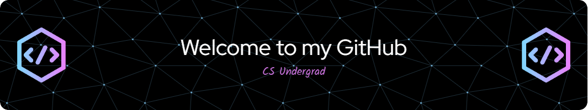

# Hi there, I'm Ryan! 👋

  

## About Me

I'm a **CS Undergrad Student @ Rutgers University New Brunswick** passionate about **game development and tackling challenging problems**. I enjoy learning new ways to apply my creativity both online and in the real world.

- 🔭 I’m currently working on **an MMO RPG (long term development)**.
- 🌱 I’m learning **how to apply my skills in systems programming**.
- 👯 I’m looking to collaborate on **any sort of game development either using Unity or Unreal Engine 5**.
- 💬 Ask me about **my MMO**!
- ⚡ Fun fact: **I love wrestling as a hobby**.

## Skills & Tools

### Languages

### Tools & Frameworks

## Projects

### Large-Scale Database Interface (React, Next.js)
- Developed a website to navigate a large database with 50K+ entries, optimizing performance and accessibility.
- Resulted in a 20% increase in efficiency for users.

### Server-Client Communication System (Python, SQLite)
- Built a secure and responsive client-server system with username/password authentication.
- Improved response time by 4 seconds compared to competitors.

### MMORPG Development (Unreal Engine, Blueprint)
- Designed and implemented core game mechanics, including combat systems and immersive environments.
- Received positive feedback from beta testers.

## Get in Touch
- LinkedIn: [https://linkedin.com/in/-ryan-kam](https://linkedin.com/in/-ryan-kam)
- Email: [ryankam291@gmail.com](ryankam291@gmail.com)
